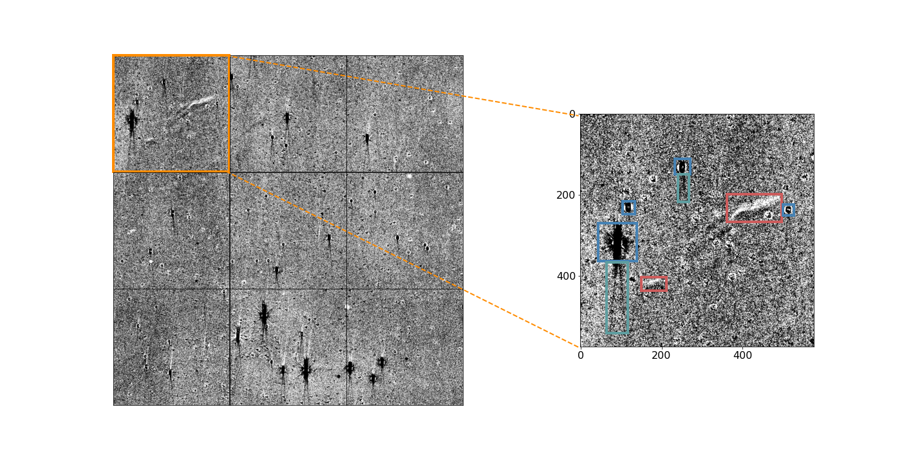
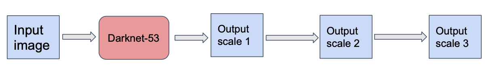
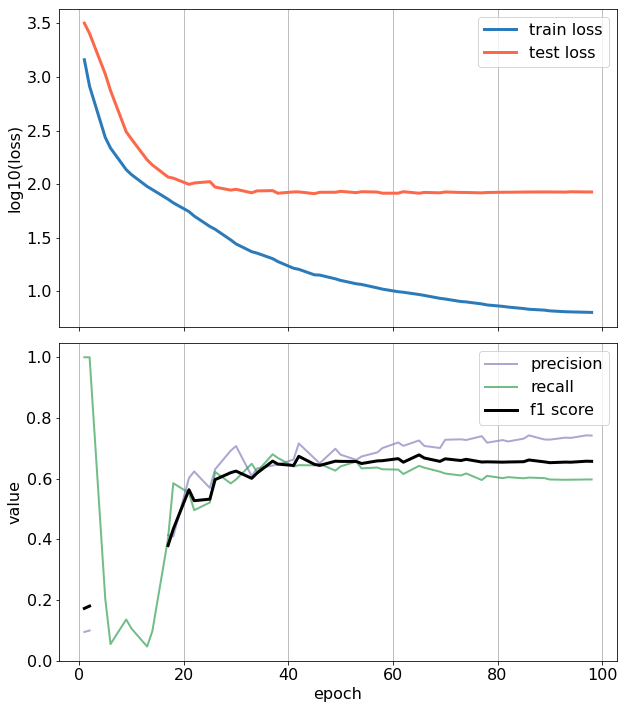

# Light Echo Detection Module

This module uses YOLOv3, a popular real-time object detection system, to detect light echoes in survey images from modern telescopes. The module is implemented in python and can be easily integrated into detection pipelines. See this [article](https://doi.org/10.3847/1538-3881/ac9409) for more details.

Dependencies

- python 3.6
- tensorflow 2.x
- numpy 
- matplotlib

## Background

Light echoes (LEs) are the re!ections of astrophysical transients off of interstellar dust. They are fascinating astronomical phenomena that enable studies of the scattering dust as well as of the original transients. LEs, however, are rare and extremely dif"cult to detect as they appear as faint, diffuse, time-evolving features. The detection of LEs still largely relies on human inspection of images, a method unfeasible in the era of large synoptic surveys. We prepared a dataset from ATLAS telescope and assessing the ability of YOLO for detection of LEs.

## Model
YOLOv3 use Darknet-53 as the backbone network to do feature extractions and make predictions at three scales (1/8, 1/16 and 1/32 the size of input image).

The YOLOv3 minimize a loss function that consists of three parts: confidence loss $L_{conf}$, classification loss $L_{cls}$ and bounding-box regression loss $L_{box}$.

$$L_{total} = L_{conf} + L_{cls} + L_{box}$$

## Results
We train the model on Google Colab platform. We evaulate the model by precision, recall and F1 score. 

## Limitations

The model has been trained on a limited dataset from ATLAS telescope.
The input image is currently cropped to $576\time 576$. 

## Future Work

Improve the performance of the model by training on a larger and more diverse dataset.

Extend the module to handle multi-channel data.

Extend the module to handle time-series image data.

## References
[YOLOv3](https://doi.org/10.48550/arXiv.1804.02767)

[Toward the Automated Detection of Light Echoes in Synoptic Surveys: Considerations on the Application of Deep Convolutional Neural Networks](https://doi.org/10.3847/1538-3881/ac9409)

Contributions

If you would like to contribute to the module, please open a pull request with your changes.

